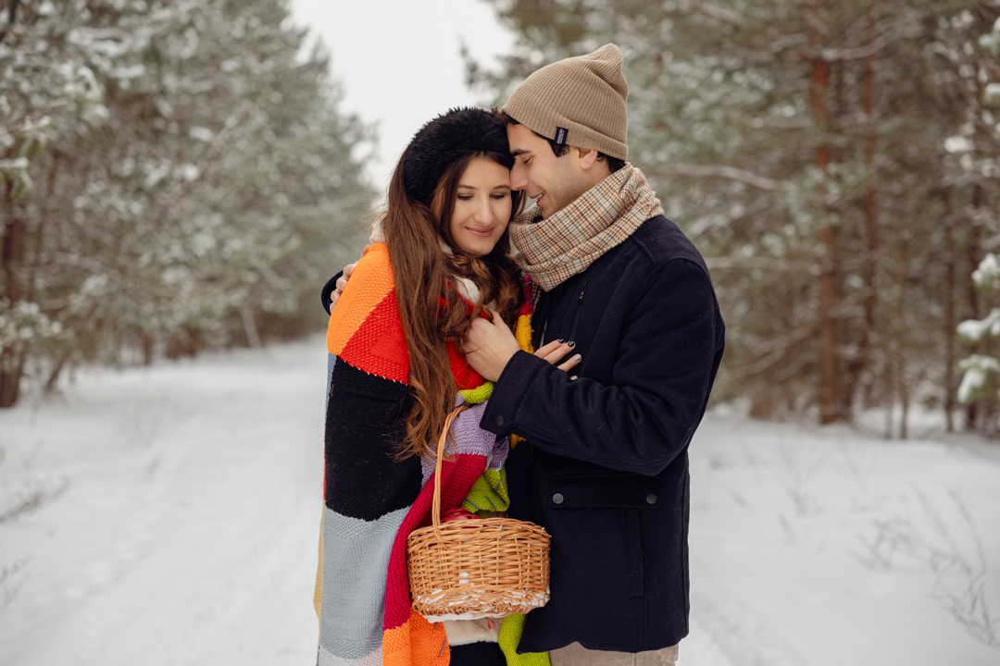
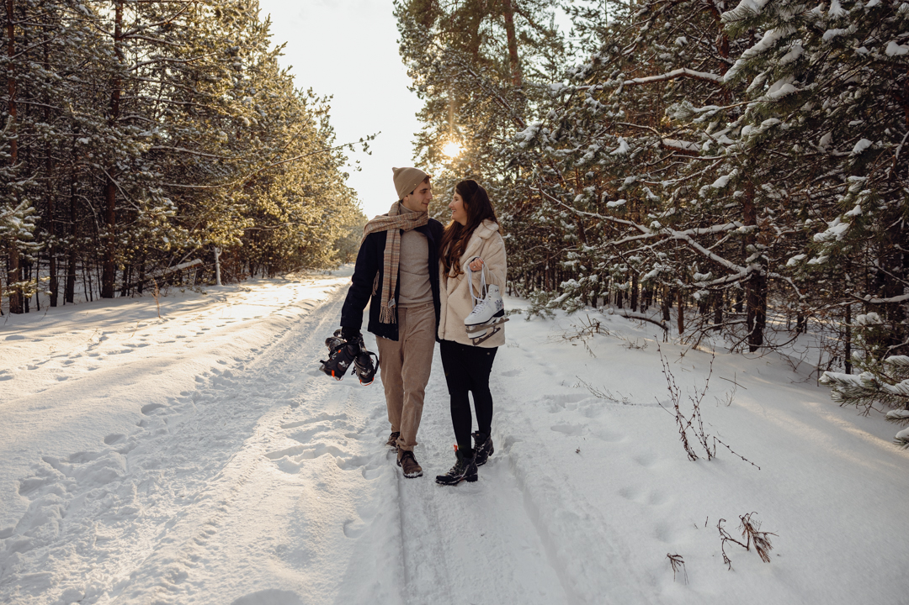
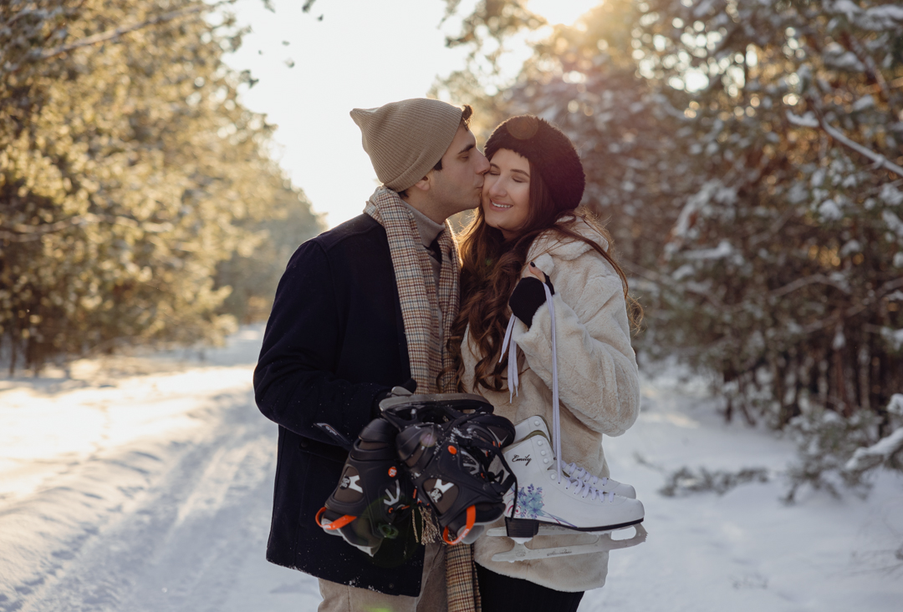
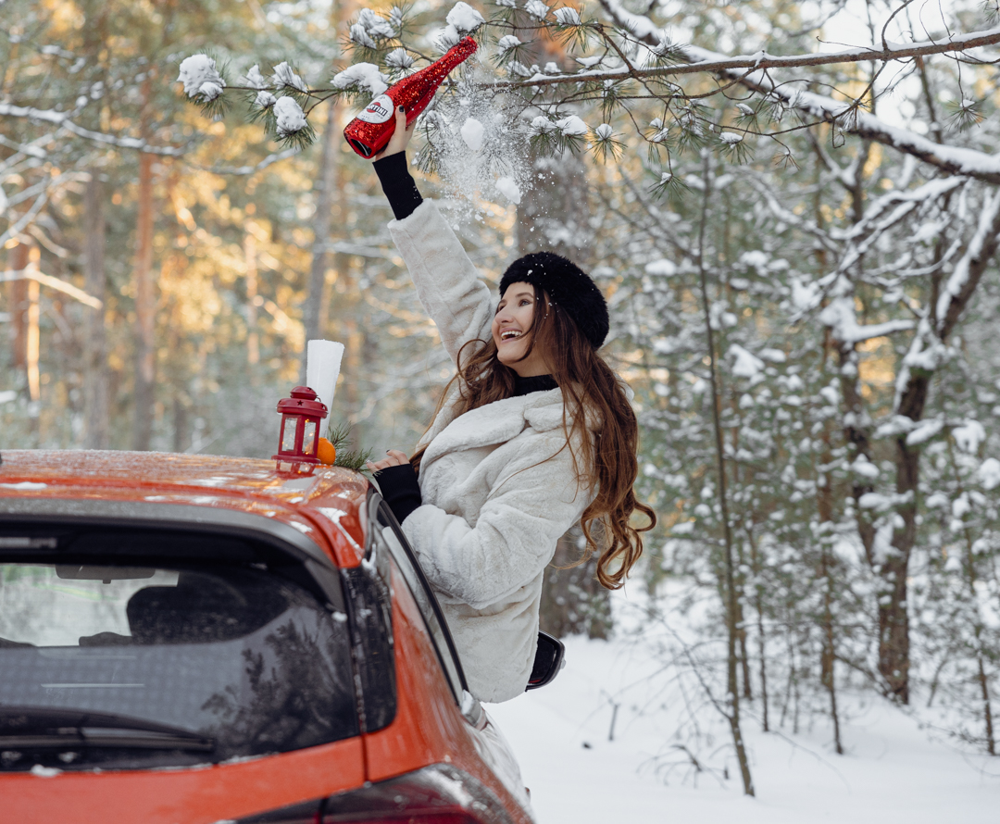
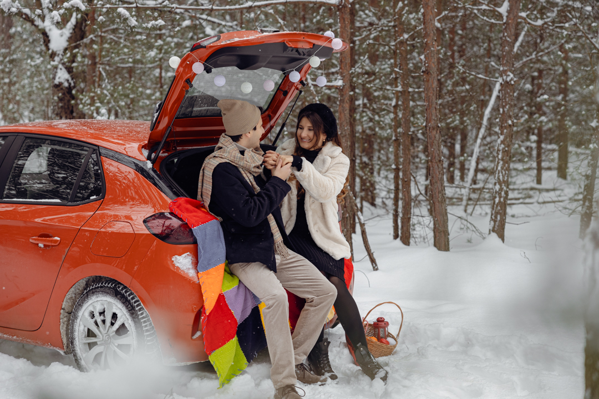
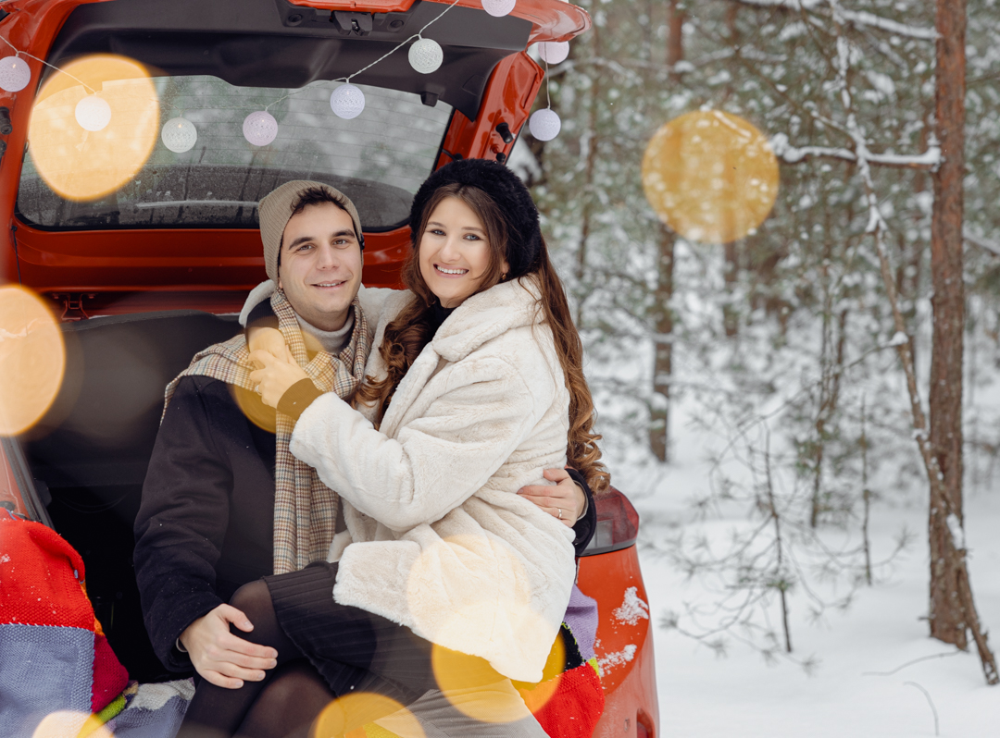
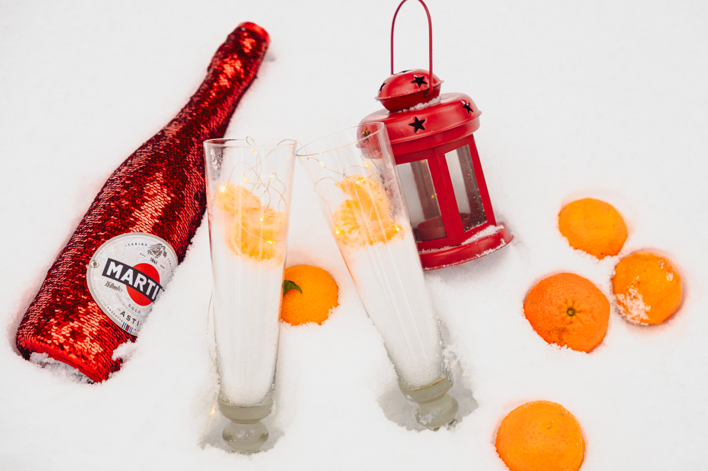

# dimawestcoast.github.io
# [Hanna Datskevich] Photography Portfolio

 <!-- Add a cover image for your portfolio -->

## About This is my photography page. Please fee free to contact me via email to instagram to set up a photosession.

Briefly introduce yourself as a photographer and describe the focus or style of your photography.

## Portfolio

### Portrait Photography

Brief description of the portrait.

### Landscape Photography

Brief description of the landscape.

### Event Photography

Brief description of the event photo.

<!-- Add more sections for different categories of your photography -->

## Technologies Used

- CANON R6 TYPE 2
- PHOTO EDITING WITH PHOTOSHOP AND LIGHT ROOM 
- VIDEO PRODUCTION AND EDITING
- 10+ YEARS EXPERIENCE AROUND THE WORLD

## HOW TO SET UP

Provide instructions on how to install and run your website locally, if applicable.

## Usage

Explain how to navigate your photography portfolio and any special features or interactions.

## Contributing

If you have any feedback or would like to contribute to the portfolio, please follow the steps mentioned in the Contributing section of this README.

## License

This photographer is licensed under the [USA FBI Photo License](LICENSE).

## Contact

- [Website](https://photographerwebsite.com)
- [Photographer's Email](mailto:datskevich.hanna@gmail.com)
- [Photographer's Instagram](https://www.instagram.com/hannadphotography/)
